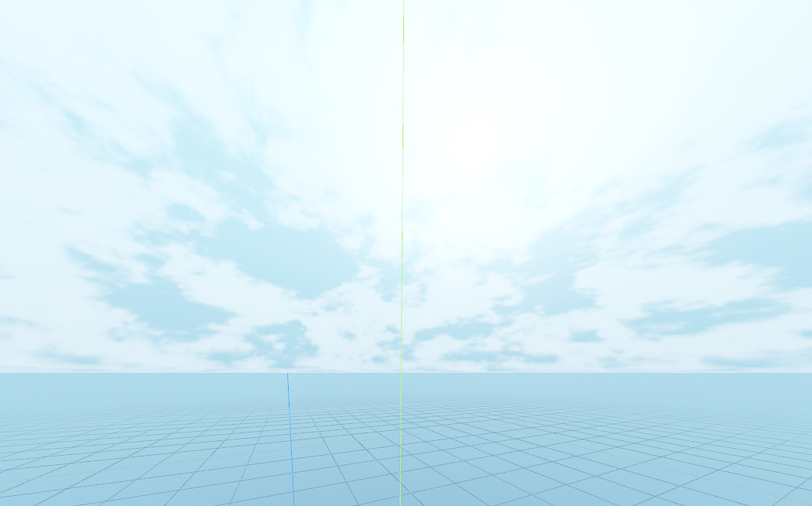
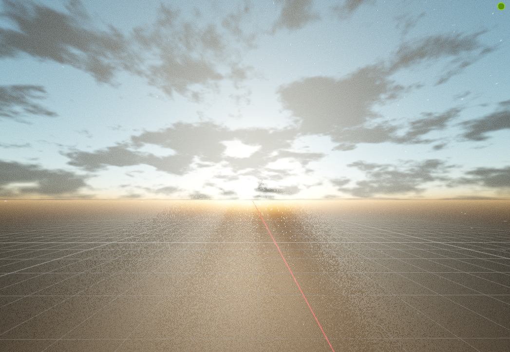

# Dynamic Day-Night cycle sky

This addon is based on the work of [Danil](https://github.com/danilw/godot-utils-and-other/tree/master/Dynamic%20sky%20and%20reflection) and built on to include a day night cycle, adding environment management, a real directional light that syncs with the sky and light effects that you can turn off from [SIsilicon's Godrays](https://github.com/SIsilicon/Godot-God-Rays-Plugin)

There's also a climate manager based on months, if you wish to change precipitation probability, the settings will be located in `res://addons/joyeux.dynamic_sky/DynamicDayNight.gd`

## How does it work?
This is a plug and play addon, simply add `res://addons/joyeux.dynamic_sky/DynamicDayNight.tscn` to your scene and the cycle will start playing. For proper setup, cameras using this sky should call `add_env_to_camera` to register themselves and see the sky properly. Otherwise you will notice that only the light shows up, though you may intend to use it like that, it looks pretty.

There are export variables for you to change, though most of them are only used for testing purposes as the night-day cycle will change the values on the run. 

## How does it look?

This is how the "Cheap" version looks like (Sky colours can be changed to whatever you like, so this is also the stylished version).

This is how the raleigh version looks like, to change how it looks you have to modify the shader. (None of the atmosphere variables are exposed in GDScript).

